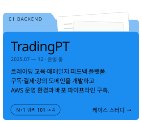
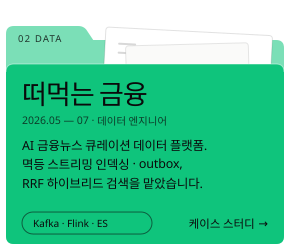
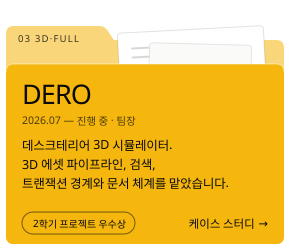

<picture>
  <source media="(prefers-color-scheme: dark)" srcset="assets/header-dark.svg">
  
</picture>

 

사용자의 요구를 API와 데이터 구조로 옮기고, 배포 뒤에도 안정적으로 도는 흐름을 고민합니다.
TradingPT에서는 구독·결제·강의 도메인과 AWS 운영 환경을, 떠먹는 금융에서는 뉴스 수집과 멱등 스트리밍 인덱싱을 맡았습니다.

**[포트폴리오](https://dongkyu-portfolio.vercel.app)** &nbsp;·&nbsp; **[qkrehdrb0813@gmail.com](mailto:qkrehdrb0813@gmail.com)** &nbsp;·&nbsp; **[LinkedIn](https://www.linkedin.com/in/dongkyu-park)** &nbsp;·&nbsp; **[solved.ac](https://solved.ac/eastking7979)**

 

## 대표 작업

  
  
  

폴더를 누르면 케이스 스터디(상황 → 판단과 기각안 → 트러블슈팅 → 회고)로 넘어갑니다.

 

## 지나온 순서

<picture>
  <source media="(prefers-color-scheme: dark)" srcset="assets/timeline-dark.svg">
  
</picture>

 

## 기술 — 쓴 곳과 함께

| | 기술 | 어디서 |
|:--|:--|:--|
| **Backend** | Java · Spring Boot · JPA · QueryDSL · Spring Security | TradingPT 구독·결제·강의 API, OAuth2 인증 |
| | Kotlin · Spring Boot | Momento 백엔드 |
| | Python · Django REST Framework · FastAPI | 떠먹는 금융 검색·Q&A API, InnoSheet Text-to-SQL 서버 |
| **Data** | MySQL · PostgreSQL · Redis | TradingPT·떠먹는 금융 데이터 모델, 세션·캐시 |
| | Kafka · Flink · Elasticsearch · Qdrant | 뉴스 스트리밍 인덱싱, RRF 하이브리드 검색 |
| **Infra** | AWS · Docker · GitHub Actions · CodeDeploy | TradingPT 운영 환경, ASG Blue/Green 배포 |
| **Test** | JUnit 5 · k6 · ShedLock | 단위·부하 테스트, 멀티 인스턴스 정기결제 중복 방지 |
| **Else** | Flutter · Three.js | Nugget 앱, DERO 3D 시뮬레이터 |

 

## 그 밖의 프로젝트

| 프로젝트 | 한 줄 | 맡은 일 |
|:--|:--|:--|
| [**Nugget**](https://dongkyu-portfolio.vercel.app/projects/nugget.html) | 시각장애인 보행 보조 앱 · Solution Challenge 2024 Global Top 100 | 팀장 · Flutter · 온디바이스 추론 |
| [**InnoSheet**](https://dongkyu-portfolio.vercel.app/projects/innosheet.html) | 자연어를 SQL로 바꾸는 CRM 서버 | Text-to-SQL 서버 단독 구축 · ERD |
| [**Momento**](https://dongkyu-portfolio.vercel.app/projects/momento.html) | 가족이 일상을 나누는 플랫폼 · UMC Hackathon 우수상 | 백엔드 리드 (Kotlin) |
| [**LoveKeeper V2**](https://dongkyu-portfolio.vercel.app/projects/lovekeeper.html) | 커플 편지·약속·캘린더 앱 | 백엔드 · ECS 배포 |
| [**GBT Hackathon**](https://dongkyu-portfolio.vercel.app/projects/gbt.html) | 건설장비 작동오일 분류 · 최우수상 (1위) | CatBoost 지식 증류 · 기획 |

 

<picture>
  <source media="(prefers-color-scheme: dark)" srcset="https://raw.githubusercontent.com/dong99u/dong99u/output/github-contribution-grid-snake-dark.svg">
  
</picture>

 

> 성능은 감이 아니라 측정으로, 우회책은 원인을 고치면 걷어내고, 지금 규모에 맞는 가장 단순한 해법을.
> — TradingPT를 운영하며 남긴 원칙

한국외국어대학교 컴퓨터전자시스템공학부 졸업 · SSAFY 15기 데이터 트랙 · 정보처리기사 · SQLD
