<picture>
  <source media="(prefers-color-scheme: dark)" srcset="assets/header-dark.svg">
  
</picture>

  <a href="mailto:qkrehdrb0813@gmail.com">Email</a> &nbsp;·&nbsp;
  <a href="https://www.linkedin.com/in/dongkyu-park">LinkedIn</a> &nbsp;·&nbsp;
  <a href="https://www.dero.life">DERO</a> &nbsp;·&nbsp;
  <a href="https://solved.ac/eastking7979/">solved.ac</a>

 

요구사항을 **데이터 구조와 실제 동작하는 시스템**으로 구체화하는 백엔드 개발자입니다.
서비스 운영에서 문제를 추적하고, 실험으로 판단을 검증하고, 선택의 이유를 기록합니다.

<picture>
  <source media="(prefers-color-scheme: dark)" srcset="assets/impact-dark.svg">
  
</picture>

TradingPT 이용자·피드백은 2026.10.06 직접 확인한 누적 스냅샷입니다. 실시간 자동 집계가 아닙니다. SQL은 출시 전 개발 서버에서 측정한 값입니다.

## `01` Selected work

### DERO · 3D 데스크테리어 시뮬레이터

**SSAFY 15기 공통 프로젝트 · 팀장 겸 풀스택 · 5인 팀** &nbsp;`2026.07 – 진행 중` 
[서비스 보기 ↗](https://www.dero.life) · **SSAFY 2학기 프로젝트 우수상** (2026.08)

책상·모니터암·소품의 규격과 호환성을 확인하고, 3D 공간에 배치해 보는 서비스입니다. 경험 없는 3D 기술은 구현 전에 Spike로 검증했고, 3D 모델 생성·압축 파이프라인과 팀의 개발 절차를 설계했습니다.

- **3D 에셋:** GLB 모델 압축 파이프라인 구축. 첫 배치를 직접 검수하고 제품 규격에 맞게 축·크기 보정.
- **검색·백엔드:** 20건씩 지연 로딩하도록 바꾼 뒤 전체 검색이 사라지는 문제를 해결하기 위해 Elasticsearch 검색을 설계·구현. PostgreSQL을 제품 정보의 정본으로 유지.
- **팀 개발:** 요구사항 → 실험 → 설계 → 검증으로 이어지는 AI 에이전트 개발 절차와 문서 정본·품질 게이트 구축.

`Next.js` `Three.js` `Spring Boot` `PostgreSQL` `Elasticsearch` `Docker`

### TradingPT · 트레이딩 교육·매매일지 피드백

**백엔드 개발 · 프로젝트 용역 계약** &nbsp;`2025.07 – 2025.12` &nbsp; BE 2 · FE 1 
서비스는 2025.12 오픈 후 운영 중 · **이용자 1,100명 이상 / 누적 등록 피드백 2,000건 이상** (2026.10.06 사용자 제공)

구독 결제, 강의 영상 접근 제어, 매매일지 피드백·통계 API를 개발했습니다. 전체 ERD를 설계하고 AWS 운영 환경과 CI/CD 파이프라인을 구축했습니다.

<b>개발 중 관리자 조회: SQL 101 → 4</b> — N+1과 커넥션 풀 고갈의 원인 해결

 

개발 서버에서 한 화면을 그리기 위해 101개의 쿼리가 발생했습니다. Customer(1-side) 기준 조회와 반복적인 저장소 호출을 Subscription(N-side) 기준 조회·Fetch Join·배치 쿼리로 재구성해 4개로 줄였습니다. **이 수치는 개발 단계의 쿼리 수이며 운영 장애 시간이나 응답시간 개선 수치가 아닙니다.**

<b>첫 유료 구독 생성 실패</b> — 트랜잭션 격리 경계 재설계

 

`REQUIRES_NEW` 자식 트랜잭션에서 결제수단을 저장한 뒤 부모 `REPEATABLE_READ` 트랜잭션이 ID로 재조회하면 새 행이 보이지 않았습니다. 결제수단 엔티티를 직접 전달해 재조회 한 건을 제거하고 구독 생성 흐름을 정상화했습니다. **서비스 전체의 결제 성공률을 측정한 수치는 없습니다.**

<b>k6 부하 테스트</b> — p95 40.7초의 병목을 로그인 인증 경로로 분리

 

개발 단계 부하 테스트에서 p95 40.7초, TPS 41.7, CPU 96%를 관측했습니다. 로그인을 제외하고 조회 API에 다시 부하를 걸어 병목이 BCrypt를 포함한 인증 경로에 있음을 확인했습니다. **서로 다른 테스트 범위를 전후 성능 개선치로 비교하지 않습니다.**

`Java 17` `Spring Boot` `JPA` `QueryDSL` `MySQL` `Redis` `AWS` `GitHub Actions`

### 떠먹는 금융 · 금융 뉴스 검색과 Q&A

**SSAFY 데이터 트랙 · 데이터 엔지니어** &nbsp;`2026.05 – 2026.07` 
[저장소 ↗](https://github.com/dong99u/de_pjt)

뉴스 수집과 멱등 스트리밍 인덱싱, 하이브리드 검색, RAG 기반 Q&A를 구현했습니다. 원본 데이터·검색 인덱스 사이의 불일치를 고려해 처리 흐름을 설계했습니다.

`Python` `Django` `Kafka` `Flink` `PostgreSQL` `Qdrant` `Elasticsearch`

## `02` More projects

| 프로젝트 | 담당 | 기술 |
|---|---|---|
| [**Nugget**](https://github.com/dong99u/Nugget-FE) · 시각장애인 보행 보조 | 팀장 · Flutter 앱 · 온디바이스 객체탐지/OCR · Google Solution Challenge 2024 Top 100 Finalist | Flutter · TFLite |
| [**Momento**](https://github.com/dong99u/momento) · 가족 대화 플랫폼 | 백엔드 리드 · UMC Hackathon 우수상 | Kotlin · Spring Boot |
| [**Love Keeper**](https://github.com/dong99u/love_keeper_BE) · 커플 소통 플랫폼 | 백엔드 개발 · ECS 배포 | Spring Boot · AWS ECS |
| [**Indayvidual**](https://github.com/Indayvidual/Indayvidual-Server) · 일정 관리 | 습관·메모 도메인 백엔드 | Spring Boot · QueryDSL |

## `03` Toolbox

   
  

`Kafka` `Flink` `Elasticsearch` `Three.js` `JUnit 5` `k6`

## `04` Beyond code

| | |
|---|---|
| **수상** | SSAFY 2학기 프로젝트 우수상 (DERO, 2026) · Google Solution Challenge 2024 Top 100 Finalist (Nugget) · GBT Hackathon Challenge 최우수상 |
| **교육** | SSAFY 15기 데이터 트랙 (2026.01–12) · 한국외국어대학교 컴퓨터전자시스템공학부 졸업 |
| **활동** | UMC 4–8기 (8기 Spring Boot 파트장) · GDSC 5기 |
| **자격** | 정보처리기사 · SQLD · TOEIC Speaking Advanced Low |

 

<picture>
  <source media="(prefers-color-scheme: dark)" srcset="https://raw.githubusercontent.com/dong99u/dong99u/output/github-contribution-grid-snake-dark.svg">
  
</picture>

Open to backend engineering opportunities — <a href="mailto:qkrehdrb0813@gmail.com">qkrehdrb0813@gmail.com</a>

